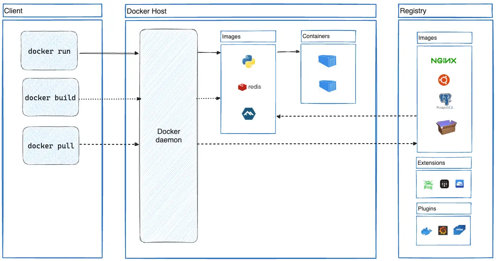

  <!-- _paginate: skip -->

  

    <h1 class="title"> Docker Básico </h1>
    

    
Arturo Silvelo

    
Try New Roads

  

---

# Introducción

---

## ¿Qué es Docker?

- **Docker** es una plataforma de código abierto que automatiza el desarrollo, despliegue y ejecución de aplicaciones. Permite separar las aplicaciones desarrolladas de la infraestructura donde se desarrollan.
- Docker se ejecuta en entornos totalmente aislados llamados **contenedores**. Estos se ejecutan directamente sobre el kernel de la máquina por lo que son mucho más ligeros que las máquinas virtuales.

---

## Virtualización

La virtualización permite crear instancias virtuales de un hardware físico, permitiendo ejecutar múltiples sistemas operativos en un solo servidor físico.

- **Virtualización:** Simula hardware completo (CPU, memoria, disco).
- **Docker:** Usa el sistema operativo del host, lo que hace que los contenedores sean más ligeros y rápidos.

| Virtualización   | Docker  |
| ---------------- | ------- |
| Pesadas          | Ligeros |
| Consumo Recursos | Rápidos |

---

  

---

# Ventajas

---

1. **Portabilidad**
   - Docker empaqueta aplicaciones junto a sus dependencias en contenedores.
   - Esto asegura que las aplicaciones se ejecuten de la misma manera en cualquier entorno.
   - Facilita el despliegue en entornos locales, servidores o la nube sin ajustes adicionales.

---

2. **Consistencia entre Entornos**
   - Los contenedores permiten que el entorno de desarrollo sea idéntico al de producción.
   - Evita problemas de compatibilidad y errores por diferencias entre entornos.
   - Garantiza que el código funcione igual en desarrollo, pruebas y producción.

---

3. **Escalabilidad**
   - Docker facilita el escalado horizontal de aplicaciones mediante la creación de múltiples contenedores.
   - Permite el uso de herramientas como Kubernetes para gestionar el escalado automáticamente.
   - Cada servicio puede escalarse de forma independiente en función de la demanda.

---

4. **Eficiencia en el Uso de Recursos**
   - Los contenedores comparten el núcleo del sistema operativo, siendo más livianos que las máquinas virtuales.
   - Se pueden ejecutar más aplicaciones en el mismo hardware, optimizando recursos.

---

5. **Velocidad de Desarrollo y Despliegue**
   - Los contenedores se inician en segundos, permitiendo un desarrollo y despliegue rápido.
   - Facilita el uso de CI/CD, reduciendo el tiempo de desarrollo y los ciclos de despliegue.

---

6. **Seguridad Mejorada**
   - Docker aísla cada contenedor, limitando el acceso entre contenedores y al host.
   - Permite ejecutar aplicaciones de distintos niveles de seguridad en un mismo servidor.

---

## Instalación

- [https://docs.docker.com/get-started/get-docker/](https://docs.docker.com/get-started/get-docker/)

**Instalación en Windows:**

- WSL: Docker se desarrolló inicialmente para Linux.
- Hyper-V: Para contenedores Windows (Licencia Pro/Enterprise)

**Instalación en MAC:**

- Chips M1: Arquitectura ARM

---

## Conceptos

- **Imágenes:** Las imágenes son plantillas de solo lectura que se utilizan para crear contenedores.
- **Contenedores:** Los contenedores son instancias en ejecución de estas imágenes.
- **Registros:** Los registros son almacenes donde se guardan las imágenes Docker.
- **Volúmenes:** Son utilizados para almacenar datos persistentes que sobreviven al ciclo de vida de un contenedor.
- **Networks:** Son utilizadas para conectar por red privadas los distintos contendores.

---

  

