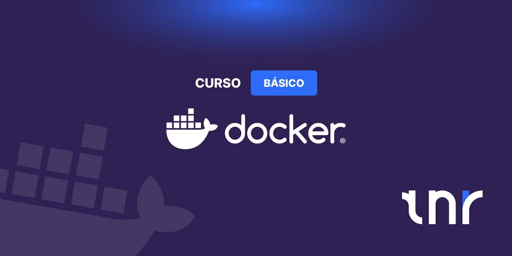

# Curso Docker Básico

**Autor:** Arturo Silvelo  
**Empresa:** Try New Roads

---

## 📚 Índice del Curso

1. **Introducción**

   - Docker
   - Virtualización
   - Ventajas
   - Instalación
   - Conceptos

2. **Contenedores**

   - Comandos básicos
     - Gestión de imágenes
     - Gestión de contenedores
     - Gestión de redes
     - Gestión de volúmenes
     - Gestión de logs

3. **Redes**

   - Qué es una IP
   - Qué es una máscara de red
   - Redes en Docker
   - Tipos de redes

4. **Volúmenes**

   - Qué es un volumen
   - Tipos de volúmenes

5. **Imágenes**

   - Qué es una imagen
   - Dockerfile
   - Instrucciones Dockerfile
   - .dockerignore
   - Crear una imagen

6. **Docker Compose**
   - Qué es Docker Compose
   - Configuración

---

## 📁 Estructura del Repositorio

El repositorio está dividido en ramas, cada una contiene un módulo específico. La rama `final` contiene todos los módulos.

En cada módulo encontrarás tres carpetas:

- **slides**: Temario del módulo
- **ejercicios**: Ejercicios propuestos
- **soluciones**: Soluciones de los ejercicios

---

## 🚀 Clonado del Repositorio con Submódulos

Este repositorio contiene submódulos (otros repositorios incluidos dentro de carpetas). Para clonar correctamente y tener todo el contenido, sigue una de estas opciones:

**Opción 1: Clonar desde cero (recomendado)**

```bash
git clone --recurse-submodules git@github.com:trynewroads/docker-course-basic.git
```

**Opción 2: Si ya has clonado el repositorio sin submódulos**

```bash
git submodule update --init --recursive
```
